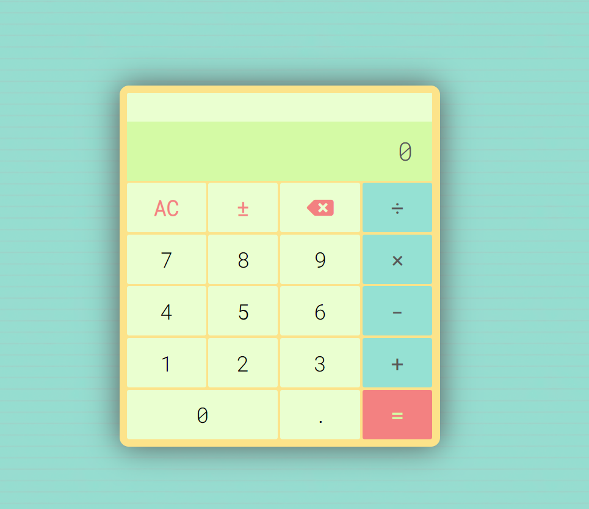

# 10-digit Calculator

## OverView

The project is inspired by [How to build an HTML calculator app from scratch using JavaScript](https://www.freecodecamp.org/news/how-to-build-an-html-calculator-app-from-scratch-using-javascript-4454b8714b98/).

The idea is to make a basic calculator.
LIVE LINK:https://optimistic-montalcini-d93b11.netlify.app/

## Features

### Click the buttons on the screen or press number keys on the keyboard.

- Responsive design (except for Galaxy Fold)
- Can handle up to 10 digits.
- Display the current value and the previous entry.
- Perform basic mathematical operations when clicked (+ - x &div;).
- AC clears the current value and changes display input to 0.
- &pm; changes the sign of the current displayed value (positive <-> negative).
- Backspace (pink arrow) deletes the rightmost digit displayed on the display.

## Additional Features

### keyboard input

You can press number keys to perfom calculations.

Use corresponding keybouard keys for &div; &times; - +.

Special keys are as follows;

- AC/CE => Delete key
- &pm; => Insert key
- Backspace => Backspace key

### Display the previous entry:

Shows the equation, and current input

### CE option:

- Clicking on any number key (incl. decimal key) changes AC to CE.
- CE clears the current entry.
- Clicking on any operation key changes CE back to AC.

### Operator followed by = :

If you hit a number, followed by an operator, followed by an equals, the calculator will give the result such that:
e.g.

2 + = —> 2 + 2 = 4

2 - = —> 2 - 2 = 0

2 × = —> 2 × 2 = 4

2 ÷ = —> 2 ÷ 2 = 1

### Excution followed by another excution :

If you hit the equals key after a calculation is completed, the last performed operation will occur again based on the current calculated value.

e.g.

keys 10–2

equal. Calculated value is 10 - 2 = 8

equal. Calculated value is 8 - 2 = 6

equal. Calculated value is 6 - 2 = 4

equal. Calculated value is 4 - 2 = 2

equal. Calculated value is 2 - 2 = 0

### Edge cases

0 typos will automatically convert into a float number,

e.g.
0012345 => 12345

00.1245 => 0.12345

.123 => 0.123

-.12 =>-0.123

### Operator key:

If you hit any operator key one after the other, the last operator key will be applied for the calculation.

e.g. if you hit 5 + - &div; &times; then the last operation will be applied to the calculation, i.e., 5 x

## Running The Project locally

### Live version

[10 Digit Calculator](https://optimistic-montalcini-d93b11.netlify.app/)

1. Clone this project locally
2. Run `npm install` in your bash/command line
3. Run `npm start` in your bash/command line

#### jest testing

- Run `npm test` in your bash/command line

## Dev Dependencies

Add-on packages include:

- Jest
- Babel
- Parcel Bundler

Color inspiration from [Color Hunt](https://colorhunt.co/)

Background pattern from [Transparent Textures](https://www.transparenttextures.com/)

Fonts from [Google Fonts](https://fonts.google.com/)

Icons from [Font Awesome](https://fontawesome.com/)
